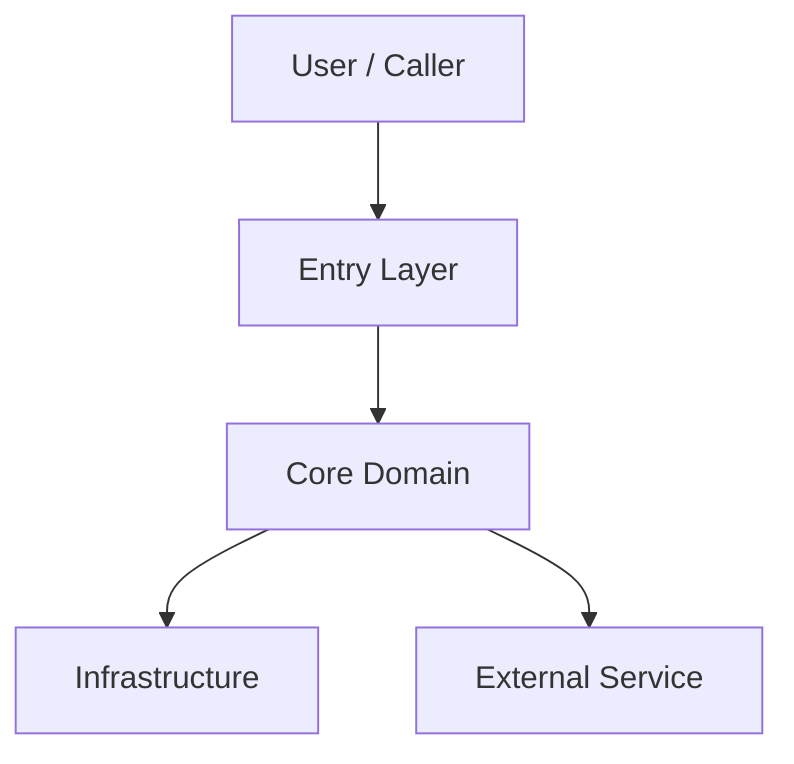
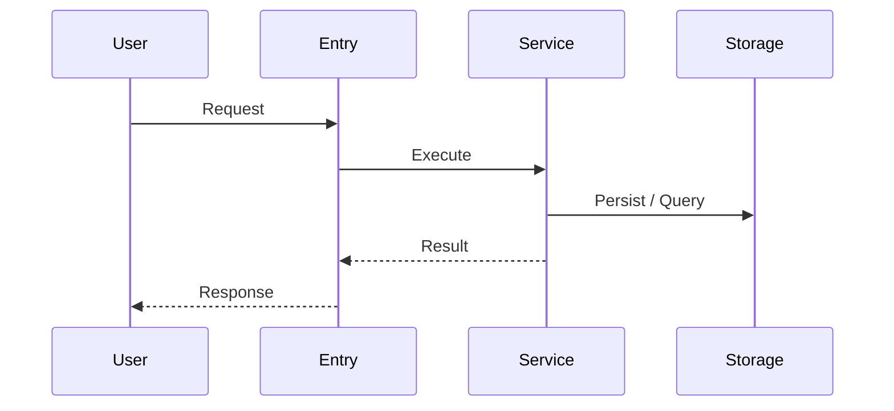

# 系统架构文档：[PROJECT NAME]

**文档位置**: `docs/architecture.md`  
**生成模式**: `init | update`  
**最后更新**: [DATE]  
**事实来源**: [代码 / 配置 / README / 现有文档]

---

## 1. 文档概览

### 1.1 文档目标

[说明该文档用于帮助团队理解系统全貌、核心流程、实体边界和演进方向。]

### 1.2 系统范围

[说明当前文档覆盖的系统边界、仓库范围和主要对象。]

### 1.3 术语说明

| 术语 | 含义 |
|------|------|
| [Term] | [Definition] |

---

## 2. 总体架构说明

### 2.1 架构摘要

[用 2-4 句话说明系统的总体分层、关键模块和主要协作方式。]

### 2.2 核心模块

| 模块 | 职责 | 主要输入 | 主要输出 | 状态 |
|------|------|----------|----------|------|
| [Module] | [Responsibility] | [Input] | [Output] | [已实现 / 规划中] |

### 2.3 外部依赖与基础设施

| 依赖 | 用途 | 交互方式 | 状态 |
|------|------|----------|------|
| [Dependency] | [Purpose] | [HTTP / RPC / MQ / DB / File] | [已接入 / 规划中] |

---

## 3. 总架构流程图

### 3.1 图示说明

- [说明节点含义]
- [说明主调用链或数据流]

---

## 4. 核心功能与核心流程图

### 4.1 核心功能概览

| 功能 | 目标 | 关键参与模块 | 当前状态 |
|------|------|--------------|----------|
| [Feature] | [Goal] | [Modules] | [已实现 / 部分实现 / 规划中] |

### 4.2 核心流程：[FLOW NAME]

#### 流程说明

[说明这个流程为什么重要、入口是什么、输出是什么。]

#### 流程步骤

1. [Step 1]
2. [Step 2]
3. [Step 3]

---

## 5. 实体设计

### 5.1 核心实体

| 实体 | 职责 | 关键属性 | 关联关系 |
|------|------|----------|----------|
| [Entity] | [Responsibility] | [Attributes] | [Relations] |

### 5.2 实体关系说明

- [说明实体之间的聚合、依赖、生命周期或映射关系]

---

## 6. 关键约束与边界

| 类型 | 内容 | 影响范围 |
|------|------|----------|
| [Constraint / Boundary / Risk] | [Description] | [Scope] |
